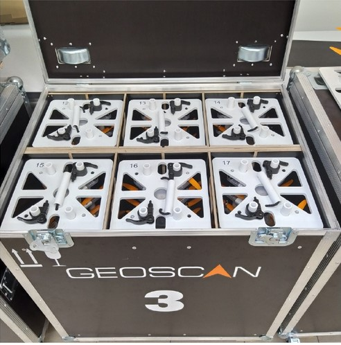
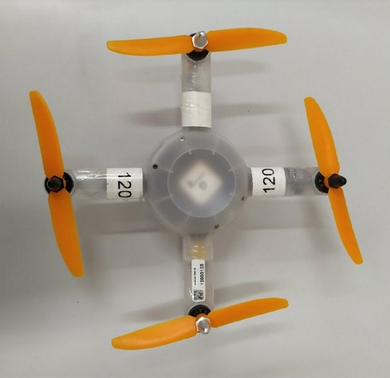
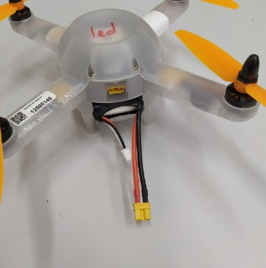
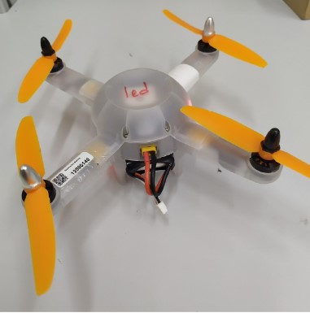

.. salute documentation master file, created by
   sphinx-quickstart on Mon Sep  2 13:02:33 2019.
   You can adapt this file completely to your liking, but it should at least
   contain the root `toctree` directive.

Инструкция для персонала шоу дронов
===================================================

.. epigraph:: Это моя стойка с коптерами. Стоек с коптерами много, но эта - моя. Без меня моя стойка с коптерами - ничто. Без моей стойки с коптерами я - ничто. 

**Описание комплекта**

Для проведения шоу дронов используются квадрокоптеры Геоскан Салют. При транспортировке и хранении они размещены в стойках, по 10 штук в каждой. Стойки хранятся в защитных кофрах с маркировкой компании. 

   Кофр снаружи

   Кофр изнутри

В каждый кофр помещается до шести стоек с квадрокоптерами. 

Номер каждого квадрокоптера указан на двух противоположных лучах рамы. Номер стойки соответствует первым цифрам номеров квадрокоптеров, находящихся в ней. 

   Номера на квадрокоптере

.. attention:: Нумерация стоек и дронов **начинается с нуля**. Так, в нулевой стойке лежат коптеры с номерами от 0 до 9, а в 12 стойке - от 120 до 129. Чем больше номер дрона, тем он ниже в стойке.

   Номера квадрокоптеров в стойке

Расстановка перед запуском
============================

1. Извлеките стойки из кофров и поставьте в начале соответствующего ряда на стартовой площадке (см. схему) 

   Схема расстановки дронов на старте

.. note:: **Не снимайте крышку стойки**, это приведёт к выпаданию дронов из неё. Ослабьте фиксаторы, поднимите крышку как можно ближе к верхнему краю направляющих трубок и снова затяните фиксаторы. Теперь дроны можно достать по одному, поворачивая их вокруг горизонтальной оси и вынимая между трубок, а стойку по-прежнему можно переносить за ручку сверху. 

2. По команде руководителя полетов начните расставлять квадрокоптеры по мере возрастания номеров. При этом передняя часть дрона (с разъемом microUSB) должна смотреть на север. Соответственно, тыльная сторона (с проводами аккумулятора) должна быть обращена на юг. Если руководитель полетов меняет порядок расстановки коптеров, направление остается тем же - USB на север, провода аккумулятора - на юг. Расстояние между соседними дронами должно быть **не менее 1 метра**.

3. При расстановке убедитесь, что пропеллеры каждого дрона вращаются свободно и ничего не задевают, в том числе на земле. Особое внимание обратите на свободный провод аккумулятора, при необходимости отогните его вниз.

4. Дождитесь команды руководителя и начинайте включать квадрокоптеры по одному. Для этого включите вилку желтого разъема XT30U-F в соответствующее гнездо в корпусе коптера. Разъем **не двусторонний**, если подключиться не получается - поверните вилку на 180 градусов и попробуйте снова. 

   Отключенный квадрокоптер

   Включенный квадрокоптер

 
5. Через десять минут после включения проверьте, принимают ли квадрокоптеры поправки с базовой станции. Об этом сигнализирует мигающий (два или три раза в секунду) зелёный светодиод на правой стороне квадрокоптера. Если зелёный светодиод мигает одиночными вспышками, не мигает или вместо него светится красный светодиод, немедленно сообщите номер квадрокоптера руководителю полётов и продолжайте проверку. 

   Горит красный светодиод, поправки не принимаются

   Горит зелёный светодиод, поправки принимаются

Во время шоу 
========================

Пока дроны в воздухе, весь персонал должен находиться в зоне, указанной руководителем полётов. При нештатных ситуациях выполняйте указания руководителя. 

После полета 
========================

1. По команде руководителя полетов соберите квадрокоптеры в стойки, начиная с больших номеров. Например, квадрокоптера № 129 первым укладывается в стойку 12. Таким образом он окажется самым нижним, а № 120 - верхним. 

2. Отключите питание квадрокоптеров, плавно потянув за два силовых провода аккумулятора. Не извлекайте аккумуляторы из квадрокоптеров. 

3. Уложите стойки в соответствующие кофры, закройте их и сообщите о готовности руководителю полетов. 

Если за время полета некоторые квадрокоптеры упали, их необходимо найти и записать номера. После этого упавшие дроны можно складывать в стойки согласно п.1. 

.. Attention:: Если в стойке не хватает квадрокоптеров, обязательно сообщите их номера руководителю полётов. 

.. toctree::
   :maxdepth: 2
   :caption: Contents:
